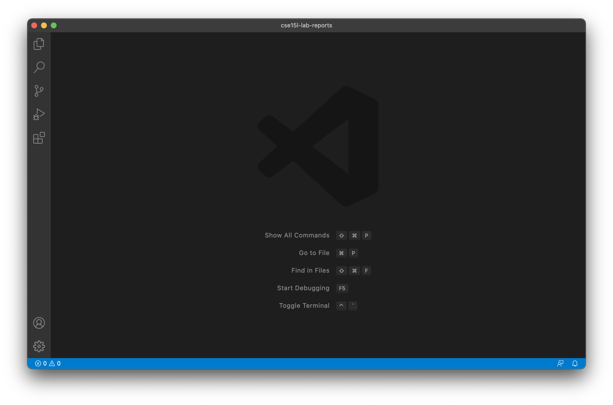
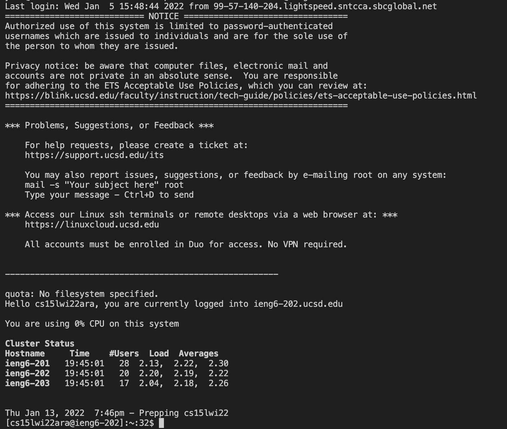
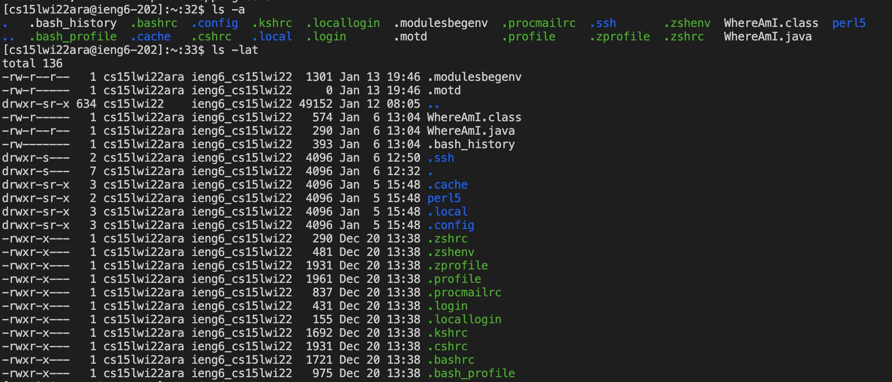
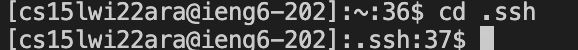
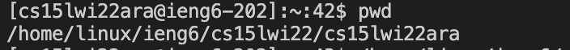
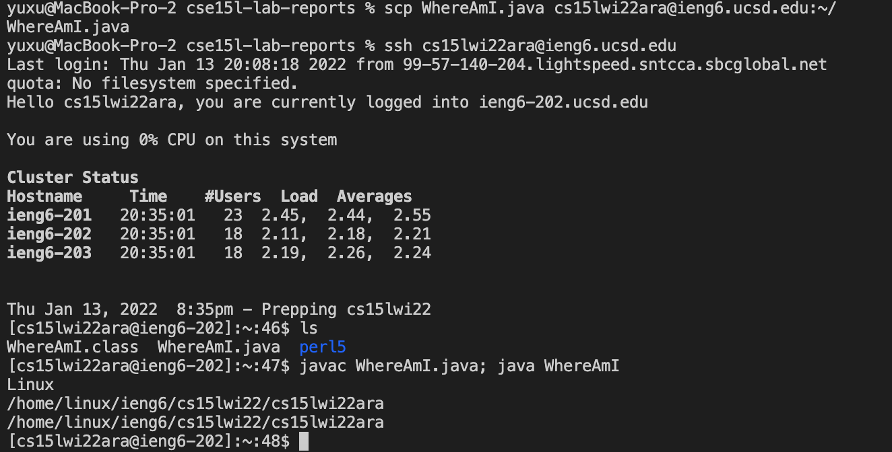
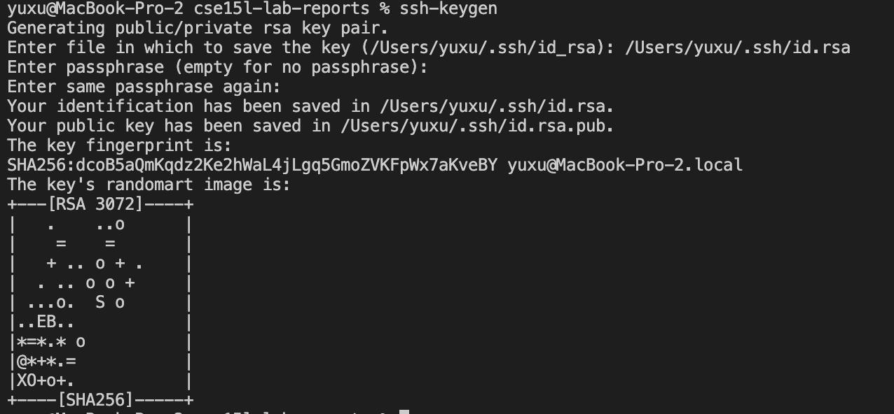
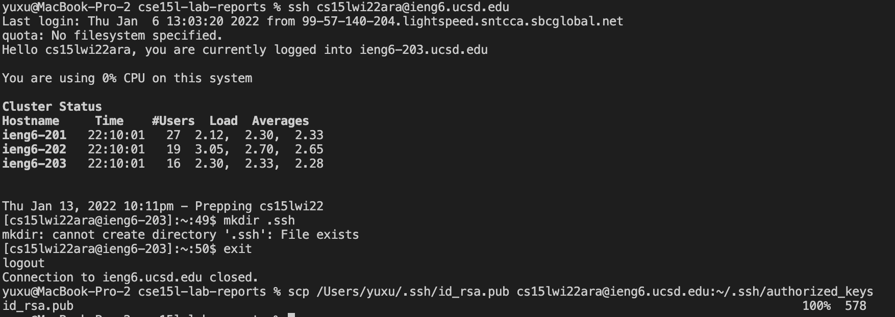
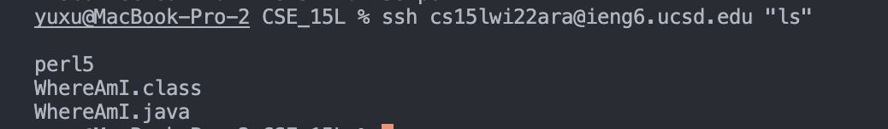
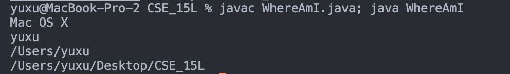

# How to Log into a course-specific account on ieng6
Yu Xu's CSE 15L Week 2 Lab Report

## Installing Visual Stuodio Code
* Download [Visual Studio Code](https://code.visualstudio.com/) from this website. 
* Follow the steps of installation. When Visual Studio Code is installed, you should be able to open a window like this:

## Remotely Connecting
1. If you are on Windows, [Install OpenSSH](https://docs.microsoft.com/en-us/windows-server/administration/openssh/openssh_install_firstuse)
2. Look up your course-specific account for your course: [https://sdacs.ucsd.edu/~icc/index.php](https://sdacs.ucsd.edu/~icc/index.php)
3. In Visual Studio Code:
> *  Input command(with the letters in front of the '@' replaced by letters in your own course account):
> 
>`ssh cs15lwi22zz@ieng6ucsd.edu`
> 
> * If you are the first time connecting to the server, this is the massage you could get:
>
>`⤇ ssh cs15lwi22zz@ieng6.ucsd.edu
The authenticity of host 'ieng6.ucsd.edu (128.54.70.227)' can't be established.
RSA key fingerprint is SHA256:ksruYwhnYH+sySHnHAtLUHngrPEyZTDl/1x99wUQcec.
Are you sure you want to continue connecting (yes/no/[fingerprint])?`
>
>(Type "yes" as the answer)
>
>*  Type in your passward (usually matches your TritionLink passward).
>
>This is the output indicating you successfully log in the server:

>
>Your terminal is connected to a computer in the UCSD CSE basement! Now you can run your commands on that computer.

## Trying Some Commands
Try running some of the commands `cd ~`, `cd`, `ls -lat`, `ls -a`, `ls <directory>`, `pwd`, `mkdir`, `cat` and `cp` both on your computer and the ucsd server computer.
>Here are some outputs you can get:
>
>
>
>`ls -a` lists all the files in the directory
>
>`ls -lat` lists the files in order beginning from the latest.
>
>
>
>`cd` changes directory
>
>
>
>`pwd` prints current working directory
>
>`mkdir` makes a new directory
>
>`cat` creates single or multiple files, views contain of file, concatenates files and redirects output in terminal or files

## Moving Files with scp
`scp` stands for *secure copy*. It is another way to copy one or multiple files from your computer to a remote computer.
>Here is how you copy the file **WhereAmI.java**(it displays the current system's os name, user name, user home and user directory) to the UCSD server computer:
>

## Setting an SSH Key
The idea behinds `ssh` is a program called `ssh-keygen`, which creates a pair of files called a `public key`(goes to the server computer) and a `private key`(goes to the client computer, your computer). After the **public** and **private** keys are copied to their designated places, the **ssh** command can use the pair of files in place of your password.
>
>Here is how you set up the ssh keys:
>
>1. generate the ssh keys:

>
> * This creates the public key (in a file *id_rsa.pub*) and the private key (in a file *id_rsa*) on your system, stored in the *.ssh* directory on your computer.
>
>2. copy the public key to the *.ssh* directory of your user account on the server.
 
> * Once you do this, you should be able to ssh from this client to the server without entering your password. 
*  ps: Above screenshots are taken after the ssh keys have been placed into both the client computer(my computer) and my course account in the server. Therefore no password needed as I show you the steps. 

## Optimizing Remote Running
Some hints in writing commands that can optimize remote running:
> 1. Write command in quote at the end of an *ssh* cammand to directly run it on the remote server, then immediately exit.
>
> For instance:
>
>
>
> 
> 2. use semicolons to divide multiple commands allow the commands to be run on the same line.
> 
> For instance:
>
>
>
## Thank you for reading this report!
