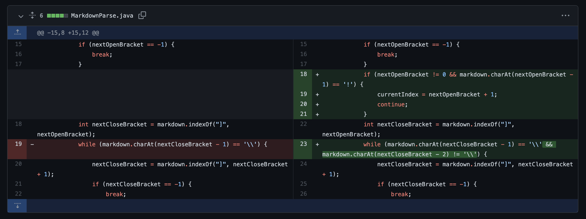

# Yu Xu's CSE 15L Lab Report 2

## code change #1

[fail test file 1](https://github.com/Yu-Xu25/markdown-parse/blob/ce6dcbf6156474a0f980316be42c1bcd66fd0d52/test-file.md)
: This test file is inducing that if a link's close bracket is not immediately followed by its open parenthesis, it is not considered a link in a markdown file.

**Symptom**: MarkdownParse file before fixing this problem has an output listing the content in between the parenthesis regardless the space between "]" and "("

**BUG**: The file return all the "links" as long as they have a "[", a "]", a "(", and a ")". It doesn't check the cases when "]" is not immediately followed by "(".

**Solution**: add a if-statement checking whether or not the next character of nextCloseBracket is openParen; if so, return the content in between the parenthesis.

## code change #2

[fail test file 2](https://github.com/Yu-Xu25/markdown-parse/blob/fca6a66c323967f4b57ee20317e2460dba7b1541/test-file.md)
: This test file is inducing that "\\]" is not considered as a link-determining close bracket in a markdown file.

**Symptom**: the output lists a correct link *https://otherlink.com* and an incorrect link *google.com*, missing an also correct link *https://somethingelse.com*.

**BUG**: the MarkdownParse file is not considering "\\" in front of "]" help "]" escapes to an ordinary literal character, hence the latter should not be considered as a nextCloseBracket.

**Solution**: enter a while loop when the character in front of the "]" is a "\\", check the next "]". If there is not a close bracket, break the function. Otherwise, exite the while loop and go on to the process.  

## code change #3
[fail test file 3](https://github.com/Yu-Xu25/markdown-parse/blob/30eda7a98151e2b31d8188d583db27200989e734/test-file.md)
: This test file inducing that if there is a "!" right in front of the "[", and everything else stays the same, this makes an image. 

**Symtom**: the output lists both valid links and an image. 

**BUG**: the MarkdownParse file cannot distinguish an image from a link.

**Solution**: check if there is a "!" in front of a "[", if so, igore this "[" (that is ignore this whole image) and look for a next "[".

# Thank you for reading!
