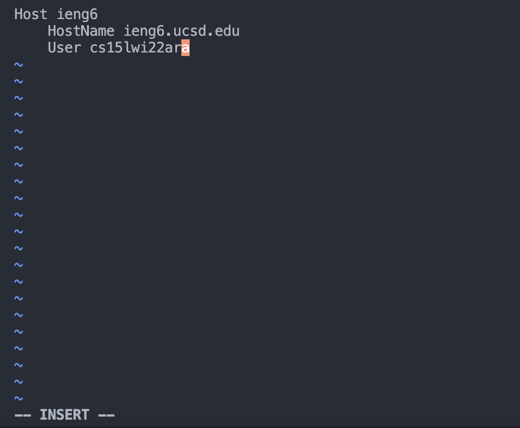
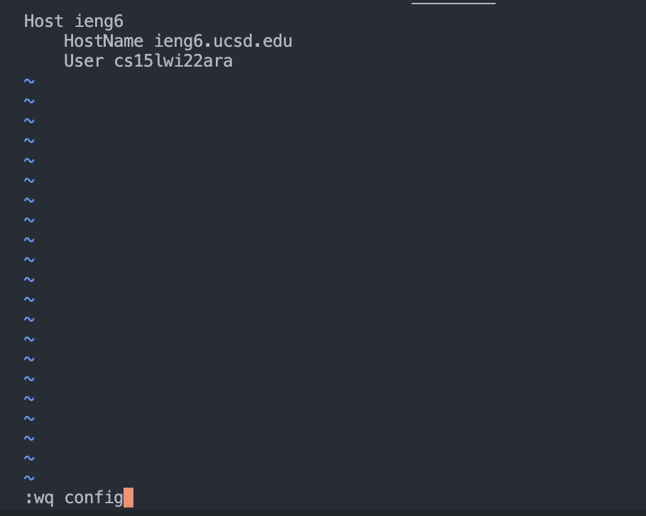
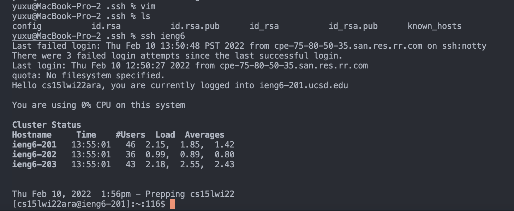
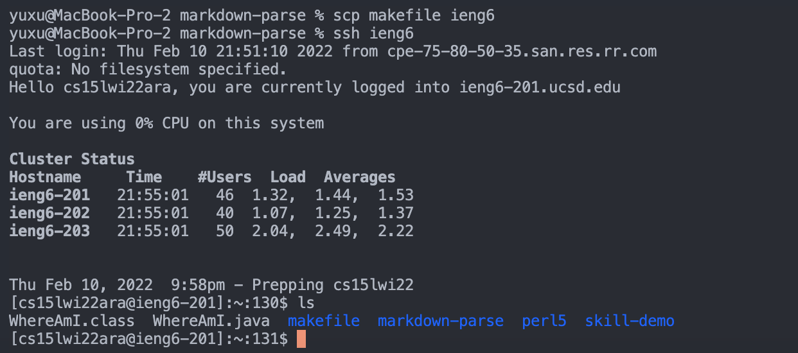

# Yu Xu's Lab Report 3

Here is a link to the [index of the site](https://github.com/Yu-Xu25/cse15l-lab-reports).

## Streamlining ssh Configuration
1. first of all, create a `config` file in the `.ssh` directory of your local computer

> a. go to .ssh directory (this can be done by enter command: `cd ~/.ssh`)
> 
> b. when you enter `vim` in the command line in order to create a `config` file, this is what the terminal looks like:
> 
>
>
> c. press **i** to enter insert mode to edit the new file. Give the **Host** a nickname of **ieng6**, and add the atual **HostName** and your **User** name corresponding to this server.
>
>
> d. quit the insert mode by pressing **Esc** on the keyboard. Create the config file by entering `:wq config` (**:wq filename** is creating a file after editing the content)
>
>
2. now we create a config file in the directory .ssh. We can list the files and see if config is inside this directory . And now we can run the ssh with our given nickname for the host to access our ieng6 server (by entering only `ssh ieng6`, a much shorter version of command).

3. Finally, we can `scp` a local file to the remote server to check if we are actually able to access the server.

I chose to copy makefile from the local directory markdwon-parse to ieng6 on the command line (`scp makefile ieng6`) and check in the server that makefile is added in my user folder!

# Thanks for reading!