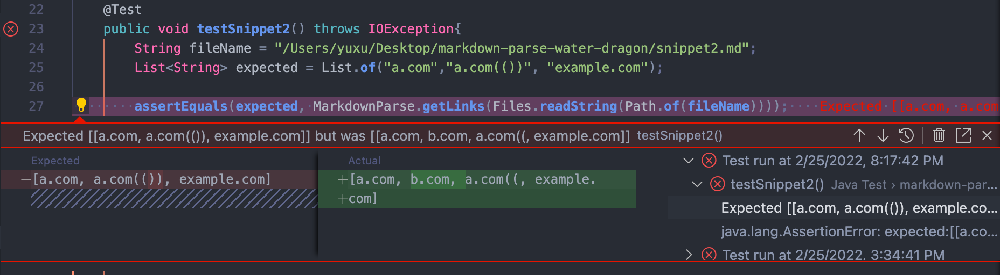

# Yu Xu's Lab Report 4

here is a link to my [markdown-parse repository](https://github.com/Yu-Xu25/markdown-parse) and a link to the [reviewed-repository](https://github.com/Yu-Xu25/mark-down-parse-water-dragon).

## here are some previews of how the snippets of code should display on screen:

According to the previews, the valid links in each snippet are
>for `snippet1`:
>1. `google.com
>2. google.com
>3. ucsd.edu
>
>for `snippet2`:
>1. a.com(())
>2. example.com
>
> for `snippet3`:
>1. https://ucsd-cse15l-w22.github.io/

Now we can write out test cases for both my version of markdown-parse and the version from the other group(group water dragon) we reviewed in lab.

## Test cases for my version:

## Test cases for reviewed version:

## here are the different outcomes when I run the JUnit tests:

**my version**:

snippet 1:

>the test case for snippet 1 failed by mistaking the first link to be a valid link and failed to see the last link to be an actual valid link. This is possibly because my version of markdown-parse didn't check the case when a pair of ` highlight a string and invalids its special meaning. 

>I think this can be fixed in a small code change by writing a if-statement that specifies when finding a pair of ` in a possible link, this link is not taken into account.

snippet 2:

>This fails to take the whole part of the second link. Because the process stop at discovering the first close paren, leaving the rest part undiscovered.

>I think this cannot be fixed in a small code change. I think I should either change the whole finding process or create a helper finding method like a stack that can cancel out matching openbracket and closebracket, openparen adn closeparen in order to fix this problem.

snippet 3:

>there is only one valid link in snippet 3, while the getLinks method found 3. Because getLinks fails to check cases when there is white space within the brackets, and cases when links missing a open/close paren for a while

>I think this can be fixed in a small code change by adding a statement that check the white space in the brackets, and a statement that check missing open/close paren before seeing another open bracket.

**reviewed version**:

snippet 1:

>this test case displays a same issue as the issue of my version of markdown-parse, please refer to content above for possible cause and suggestion.

snippet 2:

>in addition to fail to take the whole part of the second link, this method also include an invalid link. I think this is because if there is a nested link in the body of a link(either in the brackets or in the parens), the outer link becomes invalid.

>I think this can also be fixed in a small code change by adding a case about nested link.

snippet 3:

>this test case displays a same issue as the issue of my version of markdown-parse, please refer to content above for possible cause and suggestion.

# Thank you for reading!
