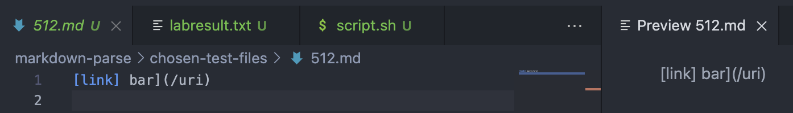
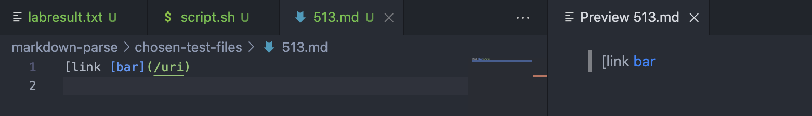
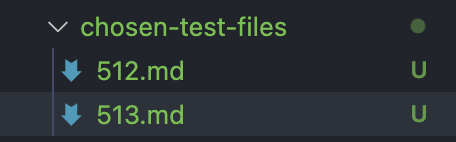
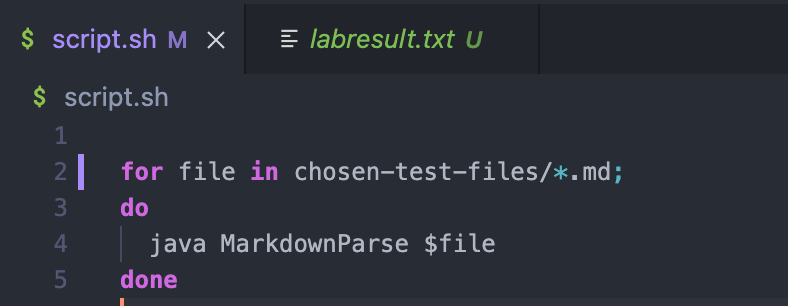
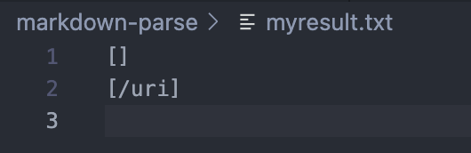
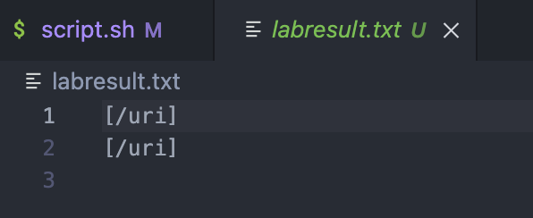
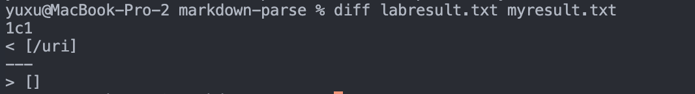
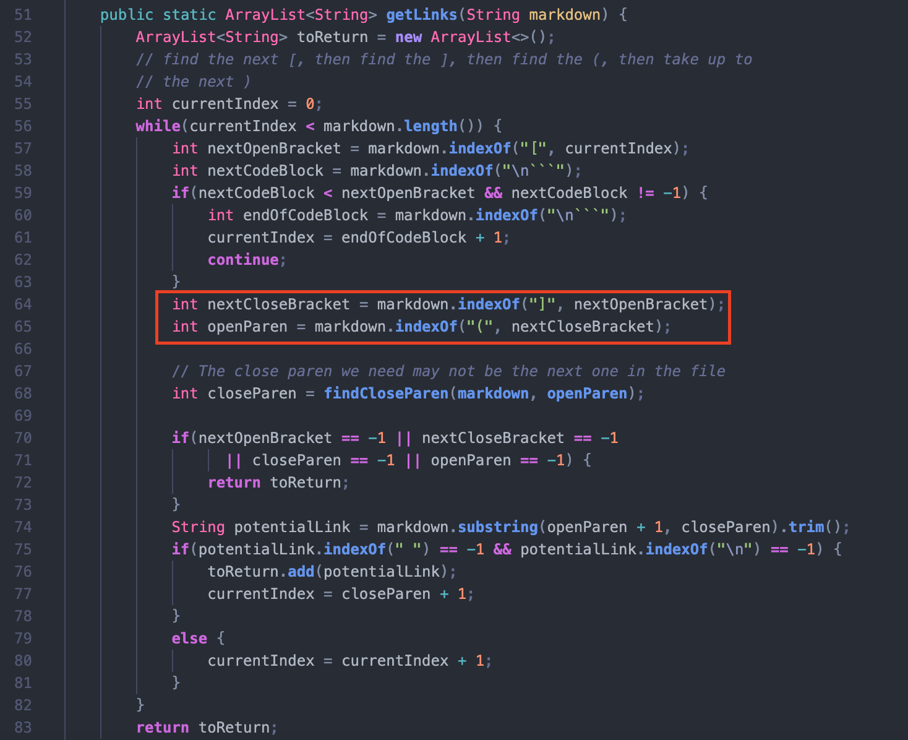

# Yu Xu's Week 10 Lab Report 5 

here is a link to [my markdown-parse repository](https://github.com/Yu-Xu25/markdown-parse) and a link to the [CSE15L markdown-parse repository](https://github.com/ucsd-cse15l-w22/markdown-parse).

The test files I have chosen are *512.md* and *513.md*, below are the contents and expected results for the two files:

1. In order to see the results of the given markdown-parse and my markdown-parse running the test files, I edited the *script.sh* files in both repositories to run chosen test files instead of all test files

2. Then I run the script.sh in the two different repositories and store the different results seperately in *my-result.txt* and *lab-result.txt*

we can see the differences in the content of text files already.

3. But I still want to find the differences through *diff*

it shows that the difference occurs at line 1, in which the labresult.txt gets the /uri, while the myresult.txt gets an empty box.

Through the differences of the outputs, we can see that the MarkdownParse in my repository has no problem in determining the links in the test files. While the MarkdownParse in our CSE15L repository shows a symptom of a bug -- failing to see `[link] bar](/uri)` is not a link.

>`Bug` at the MarkdownParse.java in CSE15L repository:
>
>
>I think the error is that the getLink method in MarkdownParse fail to respond to the case when there is more than one ']' before '('. It should take first close bracket and leave the rest of the close brackets as extra spaces in between '](',  and no extra space is allowed in a link's property.

# Thank you for reading and thank you for all your helps in this quarter!